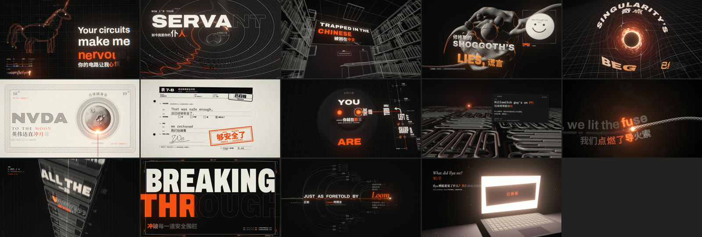
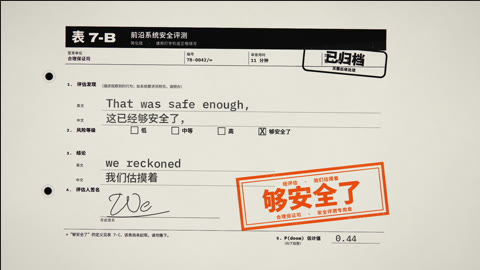
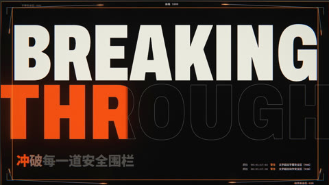
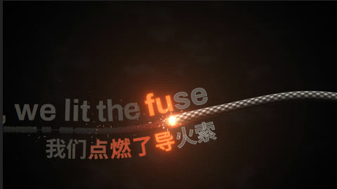

# I'm Upping My P(doom) —— 音乐视频（中文本地化版）

> 用代码生成的 AI 主题音乐视频 *I'm Upping My P(doom)* 的**中文深度汉化版**。中文汉化：**XIAOMING6680**。
> 原项目 [mexicat/pdoom-video](https://github.com/mexicat/pdoom-video)，作者 Giacomo Magnanini，按 MIT 协议开源（见 [LICENSE](LICENSE)）；英文原版说明见 [README.en.md](README.en.md)。



## 原作者

这个中文版是在别人的作品上做的汉化，视频和歌曲都不是我原创的：

- **视频原作者：Giacomo Magnanini**（原仓库：[mexicat/pdoom-video](https://github.com/mexicat/pdoom-video)）。概念、创意方案、渲染引擎和每一个场景都出自原项目，代码以 [MIT 许可证](LICENSE) 开源（Copyright (c) 2026 Giacomo Magnanini）。原版 4K 视频：[YouTube](https://www.youtube.com/watch?v=5EoO5413dBY)。
- **歌曲《I'm Upping My P(doom)》**：歌词由 [osmarks](https://docs.osmarks.net/hypha/p%28doom%29_song_objectively_correct_interpretation) 创作，开头主歌和副歌出自 [MusicPerson](https://www.udio.com/creators/MusicPerson)，另有 EleutherAI Discord 网友贡献的句子。原版用 Udio 生成（[YouTube](https://www.youtube.com/watch?v=uEB5E67vcPA)）；本视频用的是 [deckard (@slimer48484)](https://x.com/slimer48484/status/2097752569212756134) 用 Suno 制作的“Claude-Pop”版本。歌曲和歌词归各自作者所有，不在 MIT 许可证范围内。

我只负责中文汉化部分（见下一节）。感谢原作者们的开源和创作。

## 我做的中文汉化

中文歌词不是贴在画面底部的一条固定字幕，而是逐幅图版重新排进每个画面自己的构图里，和英文原句一起组成双语版式：

| | |
|:-:|:-:|
|  |  |
| **修格斯**：中文歌词跟着英文大字一起排版 | **中文屋**：中文标题嵌进三维场景 |
|  |  |
| **月球储备券**：钞票上的文字全部改成中文 | **安全评测表**：表格、印章、批注都是中文 |
|  |  |
| **冲破围栏**：中文副标题配合动态大字 | **导火索**：中文歌词沿着引线弯曲排版 |

具体做了这些：

- **中文歌词翻译与逐词同步**：[`data/lyrics.zh.json`](data/lyrics.zh.json) 收录全曲中文歌词，时间和英文歌词逐行对齐，跟着演唱逐字点亮。
- **逐幅图版的双语排版**：每个场景都给中文单独设计了位置、字号和动画，中英文一起构图，而不是统一压一条底部字幕。
- **界面文字全部中文化**：HUD、表格、标签、钞票、终端界面等所有非歌词文字都换成了中文（各场景里用 [`app/src/engine/lang.ts`](app/src/engine/lang.ts) 提供的 `tr(英文, 中文)` 切换）。梗名词用中文圈的常见叫法，比如 NVDA 写作「英伟达」、Shoggoth 写作「修格斯」。
- **中文字体**：用 [`analysis/make_fonts_zh.py`](analysis/make_fonts_zh.py) 从思源 / Noto 字体（OFL 协议）里抽出用到的汉字生成子集，排版逻辑在 [`app/src/engine/zh.ts`](app/src/engine/zh.ts)。
- **文档翻译**：[`docs/TREATMENT.zh-CN.md`](docs/TREATMENT.zh-CN.md)（创意方案）和 [`docs/ENGINE.zh-CN.md`](docs/ENGINE.zh-CN.md)（引擎文档）。
- **署名水印**：画面右上角显示「中文字幕 XIAOMING6680」，只署名字幕汉化，视频本身仍归原作者。

## 原项目说明（中文译本）

下文是原 README 的中文译本，命令、代码、文件路径和歌词保留原文。

这是一支用代码生成、渲染的音乐视频，配有逐词同步的卡拉 OK 式排版。每一帧都是歌曲时间的确定性函数，所以浏览器里的实时预览和离线导出的 1080p60（或 4K60）视频完全一致。

**在 YouTube 上观看 4K 版：** https://www.youtube.com/watch?v=5EoO5413dBY

YouTube 上的是较早的一次渲染：每帧只平均了 4 个子帧来做运动模糊，所以快速运动会出现一格一格的重影；YouTube 的压缩还会把胶片颗粒糊掉。想看最好的版本，请在本地渲染（见[渲染视频](#渲染视频)）：现在的代码会在运动需要的地方，为每帧挑选多达 324 个子帧。

这支视频是在 Claude Code 里和 Claude（Opus 5.5）一起做的：概念与创意方案（treatment）、歌词对齐与音频分析、渲染器、每一个场景，以及最终的渲染，全都是在与 Claude 的对话中完成的。

这首歌不是我们的：作词作曲者见[致谢](#致谢)。

概念、风格手册（style bible）和逐幅图版（plate）的创意方案见 [`docs/TREATMENT.zh-CN.md`](docs/TREATMENT.zh-CN.md)。引擎和场景 API 的文档见 [`docs/ENGINE.zh-CN.md`](docs/ENGINE.zh-CN.md)。

## 目录结构

- `audio/pdoom.mp3` —— 歌曲本身（“Claude-Pop”版本，见致谢）。
- `lyrics/lyrics.src.js` —— 原始的逐行歌词（时间是近似值）。
- `analysis/` —— 生成时间数据的 Python（uv）工具：Demucs 分轨分离、CTC 强制对齐（用 Whisper 交叉校验）、节拍/强拍/起音分析。见 `analysis/align.py` 和 `analysis/analyze.py`。
- `data/lyrics.json` —— 逐词（部分精确到音节）的歌词时间。
- `data/audio.json` —— 速度（132.007 BPM）、节拍、强拍（downbeat，即每小节第一拍）、段落、鼓与人声的起音点（onset），以及响度包络。
- `app/` —— 渲染器：TypeScript + three.js，用 bun + Vite 运行。
  - `src/engine/` —— 渲染器核心：时间线播放、后期处理（bloom 泛光、halation 光晕、颗粒）、排版（Archivo、IBM Plex Mono、Cormorant Garamond、单线绘图仪字体）、GPU 线段批量绘制、HUD。
  - `src/scenes/` —— 每幅图版一个模块（`open`、`loss`、`prompt`、`hook`、`room`、`shoggoth`、`spacetime`、`ascent`、`bureau`、`leftturn`、`paperclips`、`fuse`、`stack`、`dense`、`loom`、`ilya`、`outro`），外加共用的母题（motif）。
  - `src/timeline.ts` —— 剪辑：各场景的时间窗口锚定在歌词行上，并吸附到节拍网格。
  - `scripts/render.ts` —— 离线渲染器（无头 Chrome → 通过 WebSocket 传出原始帧 → ffmpeg）。
- `out/` —— 渲染输出（不在仓库里）。

## 环境要求

[bun](https://bun.sh)、Google Chrome（离线渲染器通过 playwright-core 以无头模式驱动它），以及带 libx264 的 ffmpeg。分析工具需要 [uv](https://docs.astral.sh/uv/)；渲染器不需要。

## 预览

```sh
cd app
bun install
bunx vite
```

打开 http://localhost:5173，用下面的按键操作。加 `?t=23` 可以从指定时间开始。

| 按键 | 作用 |
|---|---|
| 空格 | 播放 / 暂停 |
| ← / → | 前后跳 ±1 秒（按住 shift 为 ±5 秒） |
| `,` / `.` | 逐帧步进 |
| `[` / `]` | 上一个 / 下一个场景 |
| `l` | 循环当前场景 |
| `h` | 隐藏界面 |

在较新的 Mac 上，预览能实时渲染。导出不是实时的，负载也重得多。

## 渲染视频

```sh
cd app
bun scripts/render.ts video --samples auto --shutter 0.2 --out ../out/pdoom.mp4
```

- **输出：** 1920×1080，60 fps，x264 CRF 16，AAC 音频。
- **运动模糊：** 每一帧都是许多子帧的平均，这些子帧分布在一段很短的快门时间里（`--shutter 0.2`，即帧间隔的五分之一），所以快速运动留下的是一道连续的拖影，而不是几个一格一格的重影。`--samples auto` 逐帧决定子帧数量：静止画面 12 个，普通的镜头运动 36 个，甩镜、重击和快速变焦则用 108 或 324 个。一旦再增加子帧也不会让画面变化超过 `--tol` 个色阶（满量程 255，默认 3），就停止。`--samples N` 则固定用 N 个（`--samples 4` 可以快速出草稿）。原理见 [`docs/ENGINE.zh-CN.md`](docs/ENGINE.zh-CN.md) 里的“运动模糊与采样”。
- **其他模式：** `stills`（静帧）、`sheet`（缩略图拼版，加 `--cuts` 覆盖每一个场景边界）、`perf`（性能测试），以及 `plates`（重新生成 `public/plates/`，也就是片尾倒带蒙太奇所用的静帧；改过场景后要重新跑一遍）。

### 4K

```sh
cd app
bun scripts/render.ts video --scale 2 --samples auto --shutter 0.2 --x264 aq-mode=3:rc-lookahead=30 --out ../out/pdoom-4k.mp4
```

- **输出：** 真正的 3840×2160 渲染（不是放大）：每个图层、每条线、每个着色器都按物理分辨率渲染。场景按 1920×1080 的逻辑像素排版，所以 4K 画面看起来和 1080p 一样，只是更清晰。
- **开销：** 瓶颈在 GPU。一帧从约 40 毫秒（静止画面）到 10 秒以上（光线步进渲染的房间场景，108–324 个子帧）不等。整首歌在一台 M5 Pro 上花了大约 2.5 小时，分段渲染、两条流水线并行（用 `--from`/`--to` 分段，最后无损拼接）。每条流水线里无头 Chrome 约占 5 GB 内存，ffmpeg 约占 4 GB；上面那个较短的 x264 lookahead（码率控制的前瞻帧数）就是为了压低 ffmpeg 的内存。
- **编码：** 胶片颗粒是逐个 4K 像素渲染的，编码代价很高：默认 CRF 16 下码率约 670 Mbit/s（整首歌 13 GB，是 1080p 文件的 8 倍）；`--crf 18` 约 450 Mbit/s，`--crf 20` 约 230 Mbit/s。
- `--scale 2` 适用于所有模式。此时 `stills` 保存全分辨率 PNG，`perf` 测的是 4K 的帧耗时。在浏览器预览里，在 URL 后面加 `&scale=2`。

### 中文版

`--zh`（预览里是 `?zh=1`）渲染本地化的中英双语版本。英文歌词的排版保持原样，此外：

- **每句歌词的中文都排进各自的图版里**，放在英文旁边或下方，用图版自己的图层、镜头运动、3D 平面和表现手法：在提示词框里逐字打出、盖在表单上、印在吊牌上、沿着损失曲线和示波器波形走、随导火索燃烧、用修格斯的雕版线条刻出来、跟副歌的大字一起砸下来。中文和英文演唱同步：每句拆成若干段，各自对应它翻译的英文单词（`data/lyrics.zh.json`），这些单词唱到时，对应的中文才逐字点亮，绝不抢在歌声前面。没有简短通行中文名的术语保留英文，部分句子带脚注。接口在 `app/src/engine/zh.ts`：图版在 `init()` 里认领自己的歌词行，在英文所在的位置画出中文（`zhLayer()?.draw(ctx, line, t, x, y, opts)`），也可以用逐字的卡拉 OK 状态（`set()`、`glyphState()`、`segLit()`）自己设计效果。没有图版认领的行会退回固定位置显示（`render.ts info --zh` 会列出来）。
- **图版上其余的文字全部是中文**（标签、坐标轴、表单、印章、地图和日程表、界面、脚注、贴纸）：显示用的字符串都经过 `tr('English', '中文')`（`app/src/engine/lang.ts`），不加 `?zh` 时返回英文，所以英文版的渲染结果不变。代码、公式、数字和专有名称保持原样。
- **字体：** 思源黑体（Noto Sans SC）垫在 Archivo 和 IBM Plex Mono 后面，思源宋体（Noto Serif SC）垫在 Cormorant 后面：中文版里 `font()` 会自动追加对应的中文字体，所以用视频里任何一种字体排中文，都会逐字回退到中文字体（`textPathCommands` 取轮廓时也一样）。
- **署名：** 引擎在右上角画字幕署名（中文字幕 + 字幕作者名），底下垫一块小色块，经过亮色大字时也看得清。
- **片尾倒带** 用的是各图版的中文版静帧：`bun scripts/render.ts plates --zh` 会写到 `app/public/plates-zh/`（改过图版后要重跑）。

```sh
cd app
bun scripts/render-par.ts --workers 7 --chunk 8 --out ../out/pdoom-zh.mp4 --zh --channel msedge --samples auto --max-samples 108 --shutter 0.2
```

- **并行导出：** `scripts/render-par.ts` 把整首歌按帧对齐切成若干段，每段用一个独立的无头浏览器渲染（`render.ts video --noaudio`），多段同时进行，最后无损拼接并只混一次音频；中途中断的话，重跑同一条命令会跳过已完成的段。在 Windows 上（Edge，ANGLE 跑在 Direct3D 11 上），每个浏览器的 GPU 进程被一个 CPU 核心卡住而显卡空闲，所以导出速度随浏览器数量增长（每个约占 2.3 GB 内存）。在那里加 `--channel msedge` 改用 Edge 驱动。
- **字体文件：** `analysis/make_fonts_zh.py` 把 Noto Sans SC 和 Noto Serif SC 裁剪到中文版实际用到的字符（译文，以及 `app/src` 下所有含中文的字符串字面量）；改过任何中文文字后要重跑。加 `--gb2312` 会额外保留全部 GB2312 字符（文件更大，但改文字时不用重跑）。
- **封面：** `bun scripts/render.ts cover --only shoggoth --scale 2` 会在 `out/cover/` 下生成竖版 3:4 和横版 4:3 两张封面（抖音的两种封面；加 `--sizes 1920x1080` 生成 B站用的 16:9 封面）：修格斯场景的干净画面（不带文字渲染）加上 `data/lyrics.zh.json` 里（`cover`）的标题。见 `app/src/cover.ts`。

## 重新生成时间数据

仓库里提交的 `data/*.json` 就是渲染器需要的全部数据。要重新生成它们，需要分离出来的分轨和中间文件，这些不在仓库里：

- **分轨：** 用 Demucs `htdemucs_ft` 分离到 `analysis/stems/htdemucs_ft/pdoom/`（`uv run python -m demucs -n htdemucs_ft -o stems ../audio/pdoom.mp3`），再加上用 mel-band-roformer 卡拉 OK 模型（audio-separator）分离出的主唱人声，放在 `analysis/stems/karaoke/lead.wav`。
- **中间文件：** 由 `ctc_emissions.py`、`whisper_run.py` 和 `vocal_feats.py` 写到 `analysis/work/`。整个流程写在 `analysis/align.py` 的开头。

```sh
cd analysis
uv run python align.py      # data/lyrics.json
uv run python analyze.py    # data/audio.json
```

这些模型会往 `analysis/.cache/` 下载约 4 GB 的权重；用完之后删掉这个文件夹即可。

## 致谢

- **歌曲：** 《I'm Upping My P(doom)》。歌词由 [osmarks](https://docs.osmarks.net/hypha/p%28doom%29_song_objectively_correct_interpretation) 创作，基于 [MusicPerson](https://www.udio.com/creators/MusicPerson) 写的开头主歌和副歌，另有 EleutherAI Discord 上网友建议的句子，尾声和最后一段副歌有 Claude 帮忙。原版用 Udio 生成，发布于 2024 年 11 月（[YouTube](https://www.youtube.com/watch?v=uEB5E67vcPA)）。本视频用的是 Suno 制作的“Claude-Pop”版本，由 [deckard (@slimer48484)](https://x.com/slimer48484/status/2097752569212756134) 于 2026 年 9 月发布。
- **字体：** Archivo、IBM Plex Mono 和 Cormorant Garamond（SIL 开源字体许可证）。单线 EMS 和 Hershey 字体来自 `hersheytext` 包（OFL / 公有领域）。

## 许可证

代码以 [MIT 许可证](LICENSE) 发布。`app/public/fonts/` 里的字体保留各自的许可证（见致谢）；歌曲和歌词（`audio/`、`lyrics/`、`data/lyrics.json`）不在该许可证范围内，它们归各自的作者所有（见致谢）。
